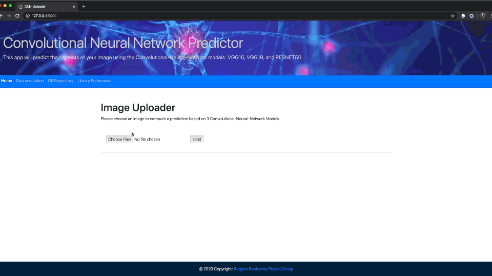

<h1>Machine Learning Challenge - Image Classification</h1>

<h2>Description</h2>
<h4>The purpose of this project is to display working knowledge in the areas of machine learning through pre-trained models and data visualization. The models used in this project were: VGG16, VGG19 and RESNET50</h4>
<h4>Tools used in this project: </h4>
    
<h2>Python Libraries</h2>
<ul>
<li>Matplotlib</li>
<li>Numpy</li>
<li>TensorFlow</li>
<li>Keras</li>
<li>Flask</li>
<li>Scikit-learn</li>
<li>OpenCv</li>
<li>OS</li>
</ul>

<h2> HTML </h2>

<h2> CSS </h2>

<h2> Javascript </h2>
<ul>
    <li>Google Charts</li>
    <li>D3</li>
    <li>Bootstrap</li>
</ul>

## Instructions

 To run this code, ensure that all the above libraries are installed in your environment

<b> Important Note:</b>
It is only necessary to run the `app.py` `Python Flask App`.

#### Steps
1. - Run the `Flask` server by running the `app.py` file.
2. - Run the IP address created by the `Flask` server which should look like http://127.0.0.1:5000/ or similar. This renders the index.html file containing the visualizations.
3. - Upload an image of your choosing to run through the ML models. The predictions and accuracies will be displayed on the HTML page.

# Directory Description
1. CNN Model Notebooks
2. Pre-Trained Models Notebook
3. Pre-Trained Models App

## CNN Model Notebooks
This file contains our team's custom CNN model as well as `Jupyter Notebooks` and other files used to support the development of this model.

## Pre-Trained Models Notebook
1. `model_predictions.ipynb` is the master notebook that runs all predictions through pre-trained models. This was used to develop and test the code that is in app.py.

## pre_trained_models_app/app.py
This file contains the `Python` code necessary to create a `Flask` development server to deploy the visualizations created using `Javascript` libraries.

## pre_trained_models_app/static
This folder contains all the `Javascript` code used to create the visualizations displayed through the `HTMl` files and to load the data from the flask server.

### Contents of Static
1. `CSS` Folder containing CSS for `HTMl` files.
2. `image` Folder that temporarily stores the user uploaded image.
3. `predictions.js` File that includes the formatting for the predictions page.

## pre_trained_models_app/templates
This folder contains all the `HTMl` code used to display all the visualizations generated by using the `Javascript` code and `libraries`.
### Contents of templates
1. `predictions.html` Page which displays the original image, prediction details and gauge. 
2. `upload.html` Page which allows the user to upload an image.

#### Authored by: <a href = 'https://www.linkedin.com/in/william-bastan-3a1a149/' target= "_blank">Bill Bastan</a>, <a href = 'https://www.linkedin.com/in/cesarmosquera' target="_blank">Cesar Mosquera</a>, <a href = 'https://www.linkedin.com/in/malini-murthy-193231187/' target="_blank">Malini Murthy</a>, <a href = 'https://www.linkedin.com/in/duyen-nguyen-a90b7741/' target="_blank">Duyen Nguyen</a>, <a href = 'https://www.linkedin.com/in/romapatel21' target="_blank">Roma Patel</a>, <a href = 'https://www.linkedin.com/in/nitin-sharma-23721517' target="_blank">Nitin Sharma</a>
